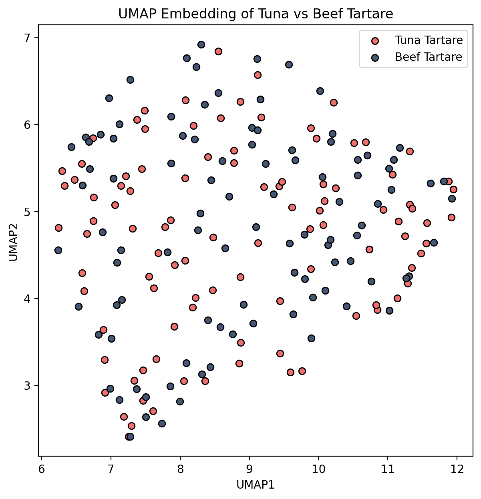

# About

This repository contains a Jupyter Notebook running Python for a computer vision project, determining which food dishes are more distinguishable than others. The images used in this project can be accessed from https://data.vision.ee.ethz.ch/cvl/datasets_extra/food-101/.

# Summary 

Through Python's Tensorflow library, I created convolutional neural network (CNN) to classify ~5,000 images of food dishes into 101 distinct types of dishes. I then performed image processing analysis through Python's OpenCV library to see if I could identify why one of the "worst performing dish" was undistinguishable from another type of dish.

Here is a breakdown of the Jupyter Notebooks:

1. **food_classify.ipynb**: I built a MobileV2Net CNN to do a classification task on ~5,000 images of food dishes.

2. **food_analysis.ipynb**: I compared the RGB values extracted from sample images of tuna tartare and beef tartare to see if there were any relevant differences between them.

# Results

Based on our classification model, the most distinguishable food dishes (based on the f1 score) are:

- Edamame
- Miso Soup
- Spaghetti Carbonara
- Mussels
- Macarons

Conversely, the least distinguishable dishes (based on the f1 score) are:

- Pork Chops
- Steak
- Tuna Tartare
- Bread Pudding
- Ceviche

One of the dishes that was often confused for Tuna Tartare was Beef Tartare. I performed  analysis of the RGB values of images for these dishes. The above image is a UMAP plot of the RGB values between 100 images of tuna tartare and 100 images of beef tartare. UMAP performs a non-linear dimensional reduction compared to principal component analysis (PCA). As seen, the UMAP plot is unable to fully separate the RGB features between the two dishes, emphasizing that the images are similar to each other.

# Relevant Python Packages

For a list of the Python packages used, please see the *envs/* directory for a version of each Python package.
